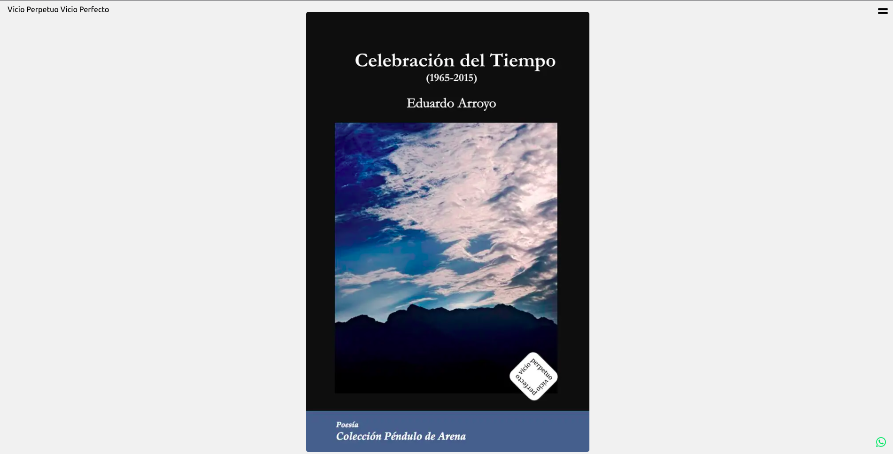
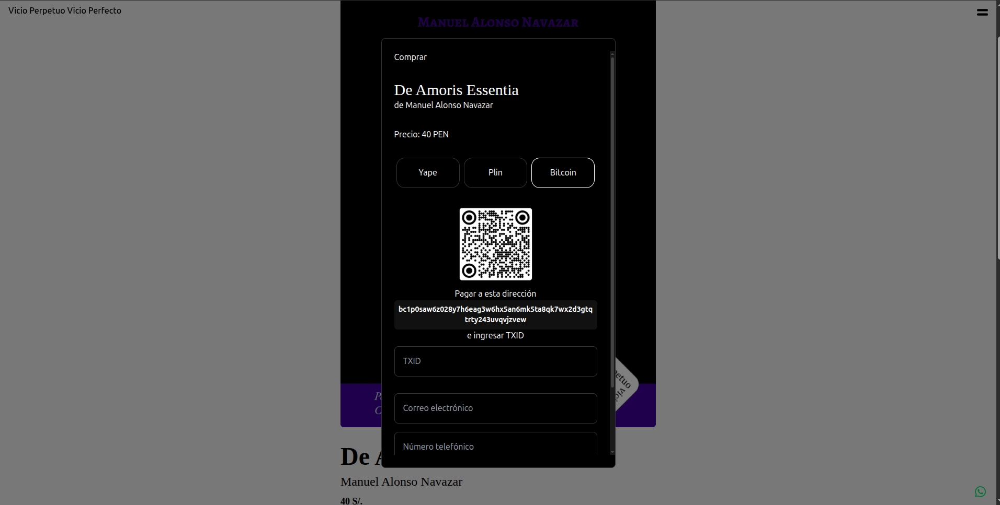

# Vicio Perpetuo | Virtual Bookstore





Welcome to **Vicio Perpetuo**, a virtual bookstore focused on promoting Peruvian culture and literature. Here you can discover and purchase books from Peruvian authors, with a special emphasis on our national identity, history, and traditions.

## Getting Started

First, run the development server:

```bash
npm run dev
# or
yarn dev
# or
pnpm dev
# or
bun dev
```

Open [http://localhost:3000](http://localhost:3000) in your browser to explore the bookstore.

## How to Buy

1. **Browse** our catalog and select your favorite book.
2. **Click "Comprar"** to open the purchase modal.
3. **Choose your payment method:**  
   - **Yape**  
   - **Plin**  
   - **Bitcoin**
4. **Follow the instructions** to complete your payment and provide your contact details.
5. Once your payment is confirmed, you'll receive your book or further instructions by email.

## Payment Methods

- **Yape**: Scan the QR code and pay to the provided number.
- **Plin**: Scan the QR code and pay to the provided number.
- **Bitcoin**: Scan the QR code and send the exact amount to the provided address. Enter your TXID for verification.

All payment methods are secure and fast, making your shopping experience easy and convenient.

## About

Vicio Perpetuo is dedicated to supporting Peruvian authors and sharing our culture through literature. We offer a curated selection of books that reflect the diversity and richness of Peru. If you consider to donate, please contact us at [editorialvicioperpetuo@gmail.com](mailto:editorialvicioperpetuo@gmail.com).
